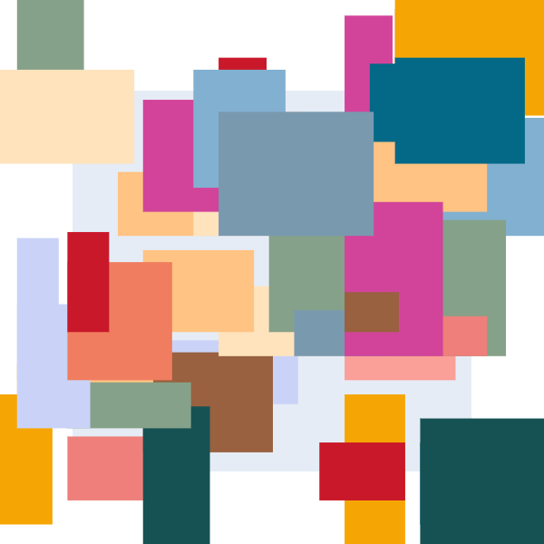
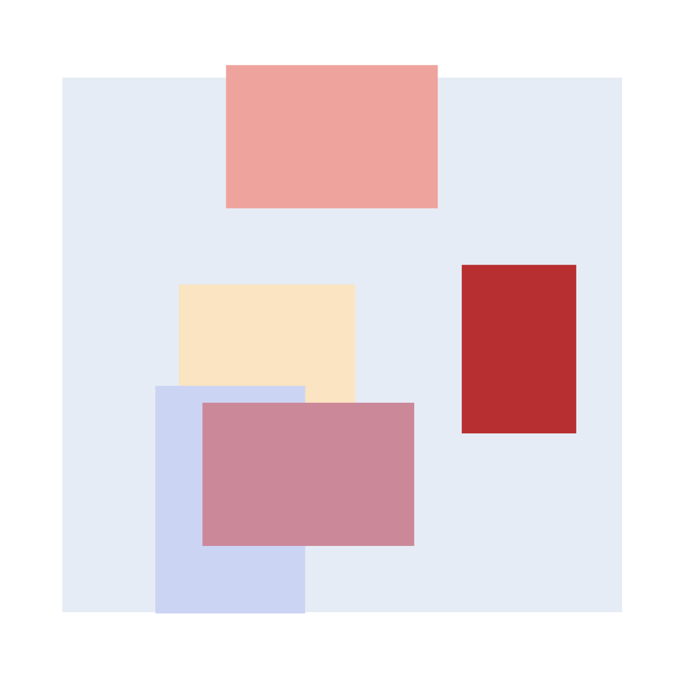
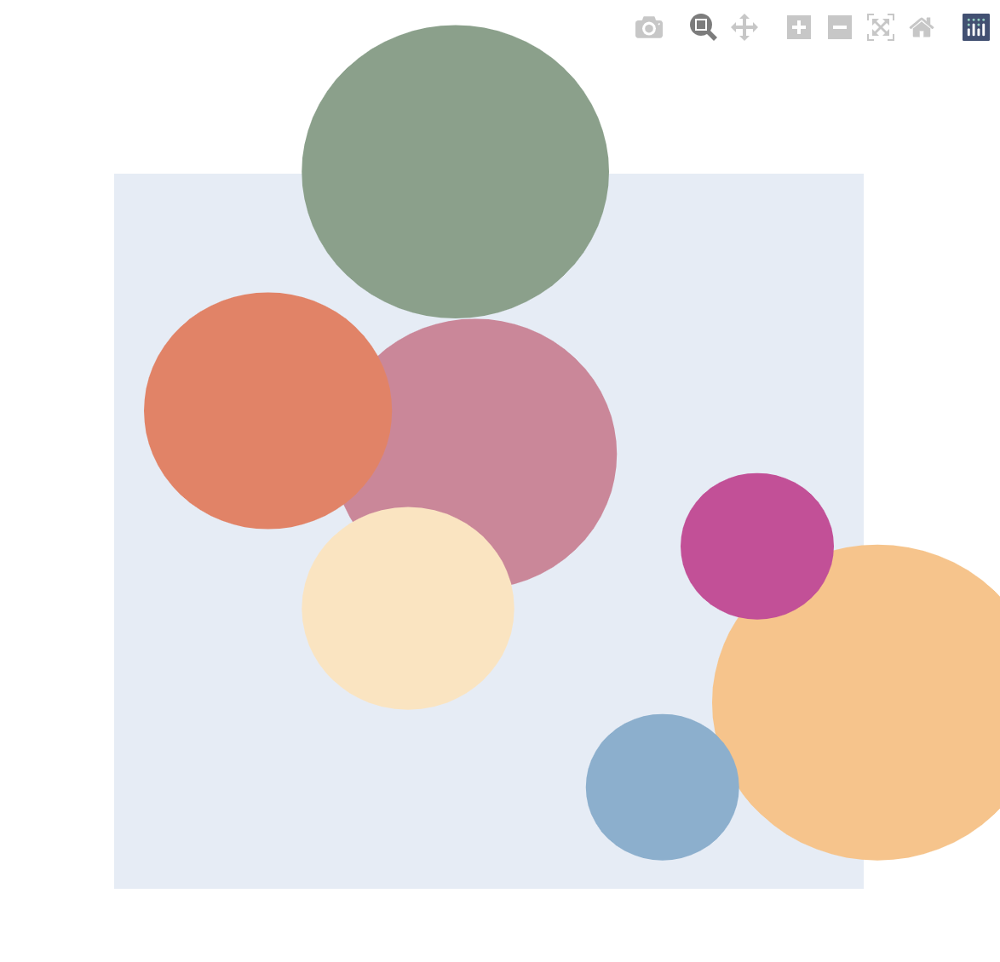

# Random Art
This project was just something fun I wrote while going through the basic Dash tutorial. Basically, you can generate random collections of circles or rectangles of varying sizes and colors.

# Running the app
Use `python app.py` to run the Dash app locally in your browser. 
The buttons select either circles or rectangles and the sliders change the size and number of shapes in the plot. Repeatedly pressing the `circles` or `rectangles` generates new plots.

Feel free to change the COLORS list with any that you like! Below are some interesting plots that I created to see a sample of what you can make.

